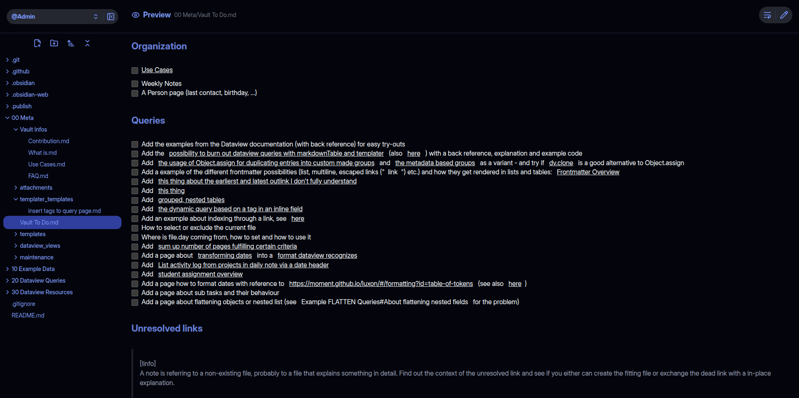
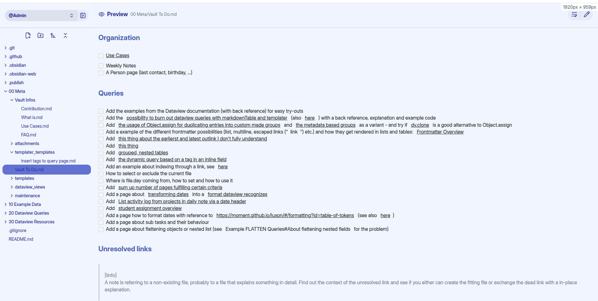
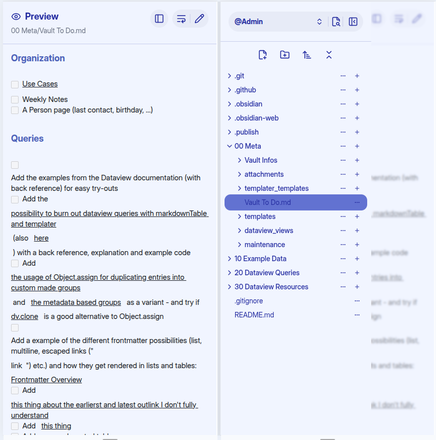
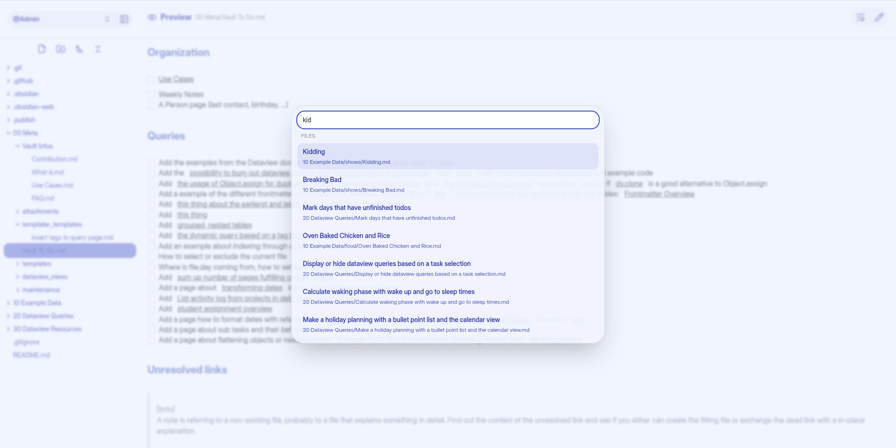

# Obsidian Web

A web app for browsing, editing, and managing an Obsidian vault through a modern frontend and a .NET API backend.

## Features

- Browse your vault as folders and notes
- Read and edit Markdown notes
- Create, rename, move, and delete files/folders
- Markdown preview support (HTML and raw markdown API variants)
- JWT-based authentication
- Vim config persistence (`/api/vimconfig`)
- Optional demo mode with write operations disabled

## Visuals

### Theme



### Desktop



### Mobile



### Search



## Tech Stack

- Frontend: Next.js 15, React 19, TypeScript, Tailwind CSS, CodeMirror
- Backend: ASP.NET Core (.NET 8), JWT auth, Markdig
- Containers: Docker + Docker Compose

## Repository Structure

```text
.
├── backend/          # ASP.NET Core API
├── web.frontend/     # Next.js frontend
├── docker-compose.yml
└── README.md
```

## Prerequisites

- .NET SDK 8+
- Bun 1.x (recommended, lockfile included)
- Docker + Docker Compose (optional)

## Configuration

### Backend

The backend reads settings from environment variables and/or app settings.

Required for normal use:

- `VAULT_ROOT`: absolute path to your Obsidian vault
- `JWT_SECRET`: secret used to sign auth tokens

Optional:

- `ASPNETCORE_ENVIRONMENT`: `Development` or `Production`
- `IS_DEMO` or `Demo__IsDemo`: set to `true` to enforce read-only write operations

Notes:

- Account credentials are stored at `VAULT_ROOT/.obsidian-web/config.json`.
- Vim keybinding config is stored at `VAULT_ROOT/.obsidian-web/config-vim.json`.

### Frontend (local dev)

Create `web.frontend/.env.local`:

```bash
NEXT_PUBLIC_API_PROTOCOL=http
NEXT_PUBLIC_API_HOST=localhost
NEXT_PUBLIC_API_PORT=2112
```

These values are used to construct the API base URL in development.

## Run Locally

### 1) Start backend

```bash
cd backend
export VAULT_ROOT="/absolute/path/to/your/vault"
export JWT_SECRET="replace-with-a-strong-random-secret"
dotnet run --urls "http://localhost:2112"
```

Useful backend endpoints:

- Swagger (Development): `http://localhost:2112/swagger`
- Health check: `http://localhost:2112/health`

### 2) Start frontend

In a separate terminal:

```bash
cd web.frontend
bun install
bun run dev
```

Open: `http://localhost:3000`

## Run with Docker Compose

Create a root `.env` file:

```bash
JWT_SECRET=replace-with-a-strong-random-secret
VAULT_ROOT=/absolute/path/to/your/vault
```

Then run:

```bash
docker compose up --build
```

The compose stack includes:

- `obsidian-backend` service
- `obsidian-frontend` service

## API Overview

### Auth

- `POST /api/login`
- `POST /api/register`
- `GET /api/account`
- `POST /api/account`

### Vault/File operations

- `GET /api/tree`
- `GET /api/folder`
- `GET /api/file`
- `POST /api/file`
- `PUT /api/file`
- `DELETE /api/file`
- `POST /api/file/rename`
- `POST /api/file/move`
- `POST /api/folder`
- `GET /api/file-index`

### Preview/Search

- `GET /api/preview`
- `GET /api/files/search`

### Vim config

- `GET /api/vimconfig`
- `POST /api/vimconfig`

### V2 raw-markdown API

- `GET /api/v2/file`
- `GET /api/v2/preview`
- `GET /api/v2/files/search`

## Development Notes

- Root `.gitignore` ignores `.env` and `.env*`.
- Frontend scripts:
  - `bun run dev`
  - `bun run build`
  - `bun run start`
  - `bun run lint`

## Roadmap

- Improve deployment docs for production reverse proxy setups
- Add automated tests (frontend + backend)
- Add CI workflows and status badges

## Contributing

Contributions are welcome. Please open an issue first for major changes, then submit a pull request with a clear description and test notes.
